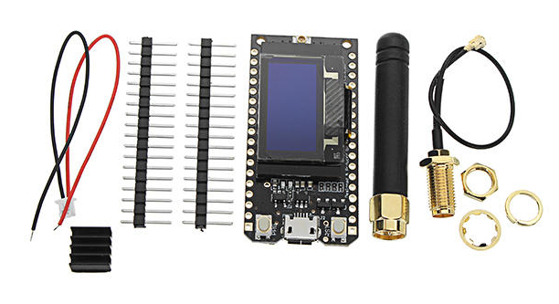
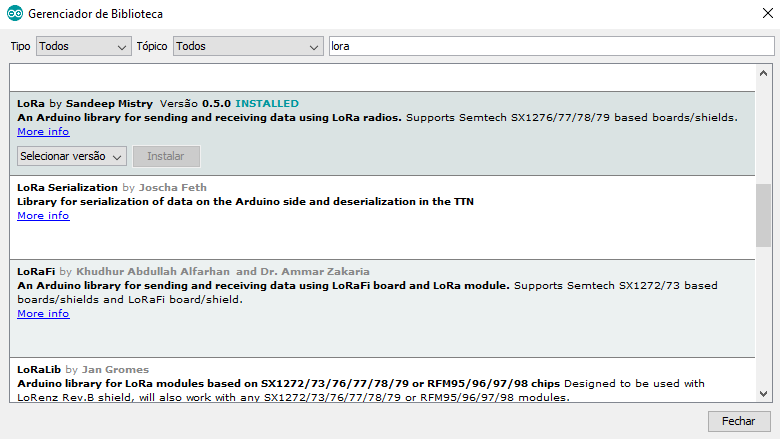

# Códigos fonte ESP8266 - Arduino IDE

LoRa utizando ESP32
------



* A especificação **LoRaWAN** é um protocolo de rede LPWA (Low Power, Wide Area) projetado para conectar sem fio sistemas operados por bateria à Internet em ao outros tipos de redes, e tem como alvo os principais requisitos da Internet das Coisas (IoT).

* Instalação da biblioteca **LoRaWAN**



* Detalhes e particularidades do código usando a IDE Arduino e ESP32 como receptor LoRa

```c++

#include <SPI.h>
#include <LoRa.h>

#define SPI_SCK   5
#define SPI_MISO  19
#define SPI_MOSI  27
#define CS_SS     18
#define RST       14
#define DI0       26
#define BAND      433E6

void setup() {
  // Mostrar informacao na porta Serial
  Serial.begin(115200);
  Serial.println();
  Serial.println("Receptor LoRa");

  SPI.begin(SPI_SCK, SPI_MISO, SPI_MOSI, CS_SS);
  LoRa.setPins(CS_SS, RST, DI0);
  if (!LoRa.begin(BAND)) {
    Serial.println("Falha ao conectar o LoRa");
    while (1);
  }
}

void loop() {
  // Verifica se existe pacaote para ser processado
  int packetSize = LoRa.parsePacket();
  if (packetSize) {
    String input = "";
    Serial.print("Pacote recebido: ");
    // Leitura do pacote recebido
    while (LoRa.available()) {
      input += (char)LoRa.read();
    }
    Serial.println(input);
  }
}

```

* Detalhes e particularidades do código usando a IDE Arduino e ESP32 como transmissor LoRa

```c++

#include <SPI.h>
#include <LoRa.h>

#define SPI_SCK   5
#define SPI_MISO  19
#define SPI_MOSI  27
#define CS_SS     18
#define RST       14
#define DI0       26
#define BAND      433E6
#define TIME_ZONE    -2

void setup() {
  Serial.println("Transmissor LoRa");
  SPI.begin(SPI_SCK, SPI_MISO, SPI_MOSI, CS_SS);
  LoRa.setPins(CS_SS, RST, DI0);
  if (!LoRa.begin(BAND)) {
    Serial.println("Falha ao conectar o LoRa");
    while (1);
  }
}

void loop() {
   // Envia via radio o pacote
   LoRa.beginPacket();
   LoRa.print("Mensagem");
   LoRa.endPacket();
   contador = millis();
}

```
