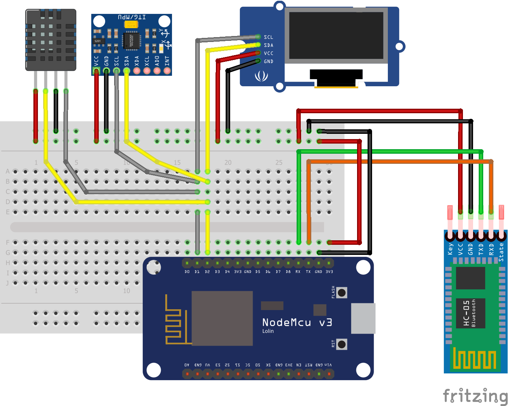

# Códigos fonte ESP8266 - Arduino IDE

Comunicação Bluetooth WEB utizando ESP8266
------

* Na utilização do Módulo Bluetooth (HC-06) devera ser seguido o esquema de ligação apresentado.
* Detalhes do sensor **HC-05** - Observar que nos pinos TX e RX são conectados os pinos RX e TX do controlador

  

Esta documentação irá guiá-lo através de várias classes, métodos e propriedades da biblioteca SoftwareSerial. 
* [Configurar módulo HC-06 - Comunica HC-06.](Comunica-HC06/Comunica-HC06.ino "Exemplo configurar módulo HC-06")
* [Configurar módulo HC-06 - Serial Passthrough](Programar_HC-06/Programar_HC-06.ino "Exemplo configurar módulo HC-06")
* [Utilzação da comunicação Bluetooth no controle de dispositivos](UART_Bluetooth_LEDS/UART_Bluetooth_LEDS.ino "Exemplo de utilização do módulo HC-06")

