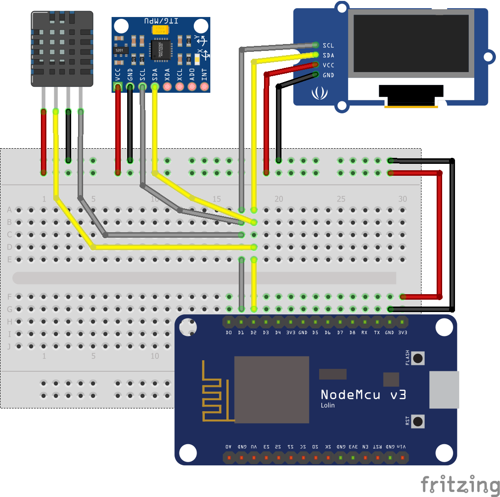

# Códigos fonte ESP8266 - Arduino IDE

Acelerômetro utizando ESP8266

* Na utilização do DMP (Digital motion Processor) devera ser seguido o esquema de ligação apresentado.
* Detalhes do sensor **MPU6050**, **AM2320** e **OLED** e o Esquema de ligação do sistema

  

