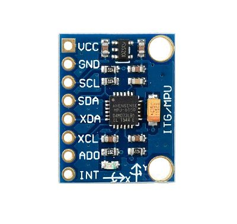
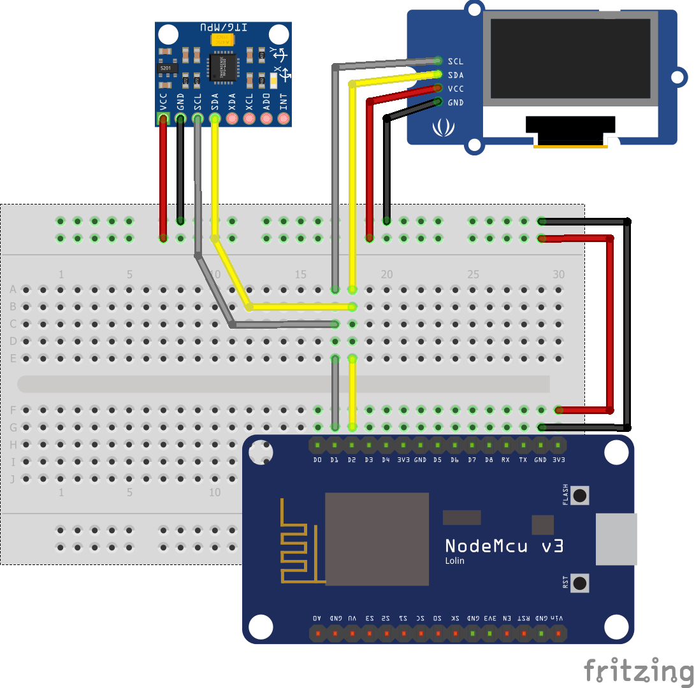

# Códigos fonte ESP8266 - Arduino IDE

Acelerômetro utizando ESP8266

* Na utilização do DMP (Digital motion Processor) devera ser seguido o esquema de ligação apresentado.
* Detalhes do sensor **MPU6050** e Esquema de ligação do sensor **MPU6050**

  
  

