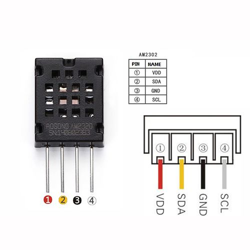

# Códigos fonte ESP8266 - Arduino IDE

Termômetro com display-OLED conectado no barramento I2C utizando ESP8266
------
<p align="center">
  
</p>

Foi necessário a utilização da biblioteca [AM2320 da Adafruit](https://github.com/adafruit/Adafruit_AM2320 "Biblioteca sensor AM2320 para uso no ESP8266") para configuração do barramento I2C.

* Para criar uma instância do sensor AM2320
```c++
#include "Adafruit_Sensor.h"
#include "Adafruit_AM2320.h"

Adafruit_AM2320 am2320 = Adafruit_AM2320();

void setup() {
  Serial.begin(115200);
  
  am2320.begin();
  
  // .. Outros códigos
}

```
* Para atualização da leitura dos valores do sensor. 
```c++
void loop() {
  Serial.print("Temperatura: "); Serial.println(am2320.readTemperature());
  Serial.print("Umidade: "); Serial.println(am2320.readHumidity());

  delay(1000);
}
```
