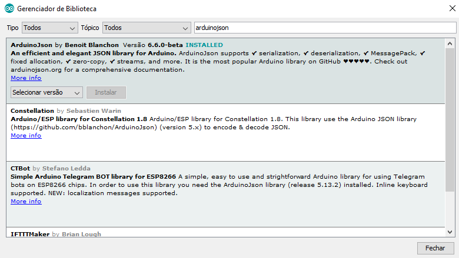

# Códigos fonte ESP8266 - Arduino IDE

JSON utizando ESP8266
------

* Acessar o site: https://arduinojson.org/

* Na utilização de JSONs com a IDE arduino e ESP8266 será necessário a importação da biblioteca **ArduinoJson**.

* Instalação da biblioteca **ArduinoJson**



* Detalhes e particularidades do código usando a IDE Arduino e ESP8266 como gerador de JSON

```c++

#include <ArduinoJson.h>

void setup() {
  // Alocacao de espaco para o documento JSON
  // 200 é o tamanho em bytes que será alocado na memoria
  // Use arduinojson.org/assistant para computar a capacidade
  StaticJsonDocument<200> doc;

  // Transforma o documento (doc) em um objeto JSON (root)
  JsonObject root = doc.to<JsonObject>();

  // Adicionando valores na JSON
  root["sensor"] = "AM2320";

  // Adicionando arrays na JSON
  JsonArray data = root.createNestedArray("info");
  data.add(28.6);

  // Serializa o objeto e mostra na Serial
  serializeJson(root, Serial);
  
  // Tambem e possivel serializar para uma String ou char info[]
  String resultado;
  serializeJson(root, resultado);
  char info[200];
  serializeJsonPretty(root, info);
}

```

* Detalhes e particularidades do código usando a IDE Arduino e ESP8266 como interpretador (parser) JSON

```c++

#include <ArduinoJson.h>

void setup() {
  // Alocacao de espaco para o documento JSON
  // 200 é o tamanho em bytes que será alocado na memoria
  // Use arduinojson.org/assistant para computar a capacidade
  StaticJsonDocument<200> doc;

  // JSON string de informacoes.
  char json[] = "{\"sensor\":\"AM2320\",\"hora\":\"23:59:59\",\"info\":[28.75, 72.30]}";

  // Deserializar o documento JSON
  DeserializationError erro = deserializeJson(doc, json);

  // Obtem o root do docuemento JSON
  JsonObject root = doc.as<JsonObject>();

  // Processamento dos valores que serao atribuidos a variaveis
  const char* sensor = root["sensor"];
  String hora = root["hora"];
  double temperatura = root["info"][0];
  double umidade = root["info"][1];
}

```
