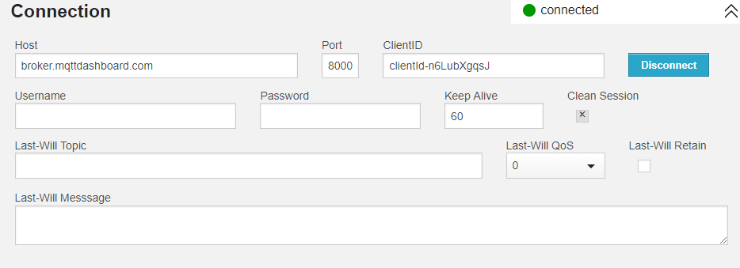
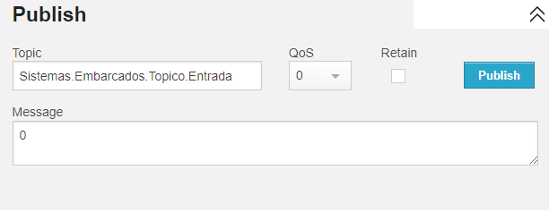
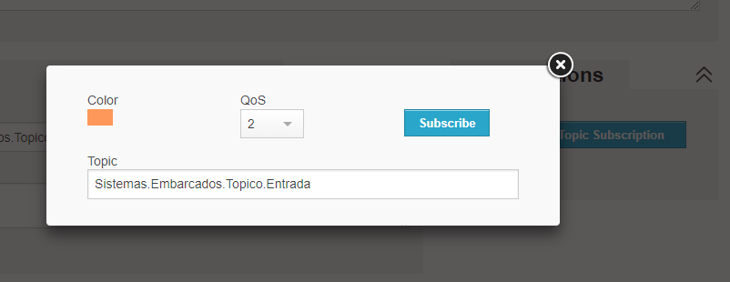
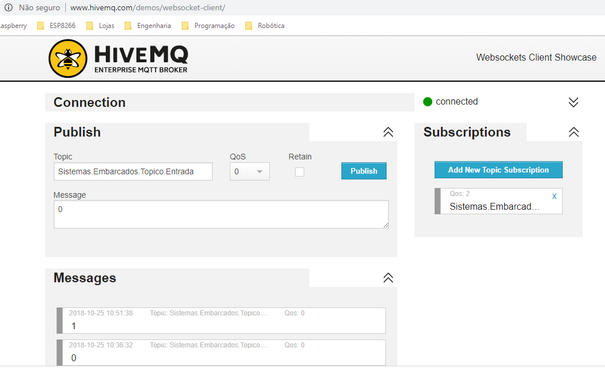

MQTT utizando HiveMQ - Enterprise MQTT Broker
------
O [HiveMQ](http://www.hivemq.com/demos/websocket-client/) é um servidor de websockets para conexão com sistemas que utilizam o protocolo MQTT
* Conexão com o HiveMQ (Broker)

* Publicar com o HiveMQ (Publish - HiveMQ)

* Assinar com o HiveMQ (Subscribe - HiveMQ)

* Visão Geral HiveMQ

      
