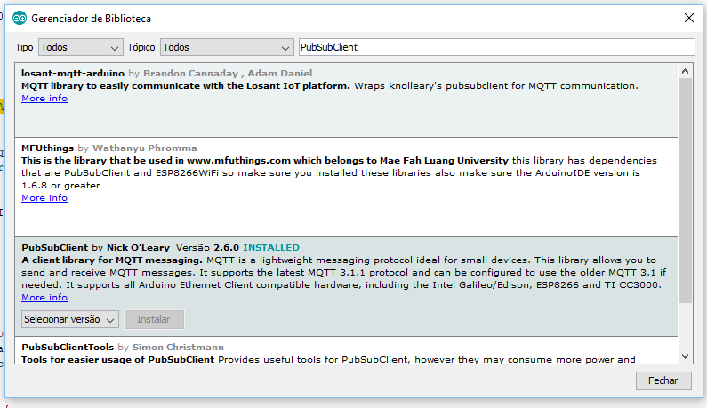

# Códigos fonte ESP8266 - Arduino IDE

MQTT utizando ESP8266
------
MQTT (Message Queuing Telemetry Transport) é um protocolo de mensagens dispositivos móveis de pequeno porte com otimização para redes TCP/IP. O esquema de troca de mensagens é baseado no modelo Publisher-Subscriber.

* [Informações adicionais sobre o protocolo MQTT](http://mqtt.org/)


###### fonte: survivingwithandroid.com

* Na utilização do protocolo MQTT com a IDE arduino e ESP8266 será necessário a importação da biblioteca **PubSubClient**.
* Instalação da biblioteca **PubSubClient**



* Detalhes e particularidades do código usando a IDE Arduino e ESP8266

```c++

#include <PubSubClient.h>

// Informações do servidor MQTT que será utilizado - MQTT Broker
const char* mqtt_server = "broker.mqtt-dashboard.com"; // Servidor MQTT - Broker gratuíto
// Identificação do canal virtual - topico que será utilizado
const char* topico = "Sistemas.Embarcados.Topico.Entrada"; 

WiFiClient clienteWIFI;
// Criação do cliente MQTT para assinaturas (subscribing) e publicações (publishing)
PubSubClient clienteMQTT(clienteWIFI);

// Método que monitora o recebimento de mensagens do broker MQTT (Servidor MQTT)
void callback(char* topico, byte* payload, unsigned int tamanho) {

  //Seu código
  
}

// Conexão com o servidor MQTT para troca de mensagens
void conectaMQTT() {
  // Loop até conexao
  while (!clienteMQTT.connected()) {
    Serial.print("Aguardando conexao MQTT...");
    if (clienteMQTT.connect(macAddress)) {
      Serial.println("MQTT conectado");
      //faz assinatura automatica no topico
      clienteMQTT.subscribe(topico);
    } else {
      Serial.print("Falha, rc=");
      Serial.print(clienteMQTT.state());
      Serial.println(" tentando reconectar em 5 segundos.");
      delay(5000);
    }
  }
}

void setup() {

  // Conexão com broker no servidor MQTT
  clienteMQTT.setServer(mqtt_server, 1883);
  // Definição do procedimento de recebimento de mensagens
  clienteMQTT.setCallback(callback);
  
}

void loop() {

  // mantem a conexão com o servidor (broker) ativa para troca de mensagens
  if (!clienteMQTT.connected()) {
    conectaMQTT();
  }
  // Thread de vericação de recebimento de mensagens
  clienteMQTT.loop();
  
}

```


