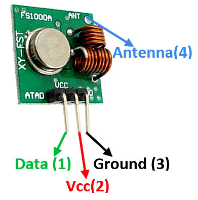

# Códigos fonte ESP8266 - Arduino IDE

Rádio Frequência (RF) utizando ESP8266
------
* Detalhes da pinagem do módulo de recepção 433MHz

 

* Detalhes da pinagem do módulo de transmissão 433MHz



* Na utilização do receptor e transmissor de Rádio Frequência (RF) com a IDE arduino e ESP8266 será necessário a importação da biblioteca **RCSwitch**.
* Instalação da biblioteca **RCSwitch**


* Detalhes e particularidades do código usando a IDE Arduino e ESP8266 como transmissor de códigos RF

```c++

#include <RCSwitch.h> //  Biblioteca para acesso conexao RF - ESP8266

// Configuracoes iniciais
#define pinoIR    2

RCSwitch transmissor = RCSwitch(); // Cria instancia de RCSwitch para transmissão de informações

void setup() {
  transmissor.enableTransmit(pinoRF); // O transmissor sera conectado ao pino "pinoRF"
  transmissor.setProtocol(6); // Será utilizado protocolo 6
}

void loop() {
   transmissor.send(0x82B2295, 28); // Envia código RF para o receptor
   delay(1000);
}

```

* Detalhes e particularidades do código usando a IDE Arduino e ESP8266 como recepção de códigos RF

```c++

#include <RCSwitch.h> //  Biblioteca para acesso conexao RF - ESP8266

// Configuracoes iniciais
#define pinoIR        2

RCSwitch receptor = RCSwitch(); // Cria instancia de RCSwitch para recepção de informações

void setup() {
  Serial.begin(115200);
  receptor.enableReceive(pinoRF); // O receptor sera conectado ao pino "pinoRF"
}

void loop() {
  if (receptor.available()) { // Verifica se existe informação disponível
    int valor = receptor.getReceivedValue(); // Armazena o valor da informação
    if (valor == 0) {
      Serial.print("Código desconhecido.");
    } else {
      Serial.print("Recebido ");
      Serial.print(valor, HEX);
      Serial.print(" / ");
      Serial.print(receptor.getReceivedBitlength()); // Obtem o valor do tamanho da informação
      Serial.print("bit ");
      Serial.print("Protoco0ol: ");
      Serial.println(receptor.getReceivedProtocol()); // Obtem o valor do protocolo de transmissão
    }
    receptor.resetAvailable(); // Prepara receptor para receber nova informação
}

```
