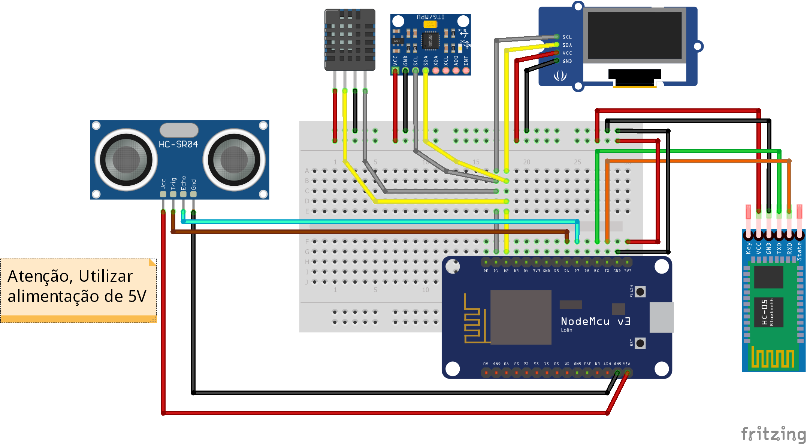

# Códigos fonte ESP8266 - Arduino IDE

Sensor ultrassônico (HC-SR04) utizando ESP8266
------

* Sensor ultrassônico (HC-SR04)  com a IDE arduino e ESP8266 será necessário a importação da biblioteca **Ultrasonic**.

* Detalhes e particularidades do código usando a IDE Arduino e ESP8266

```c++
#include <Ultrasonic.h>

 * O circuito:
 * --------------------- 
 * | HC-SC04 | Arduino |  
 * ---------------------  
 * |   Vcc   |   5V    | 
 * |   Trig  |   12    | 
 * |   Echo  |   13    |  
 * |   Gnd   |   GND   | 
 * ---------------------

#define TRIGGER_PIN  12   //D6
#define ECHO_PIN     13   //D7

Ultrasonic ultrasonic(TRIGGER_PIN, ECHO_PIN);

int distancia;

void setup() {
  Serial.begin(9600);
}

void loop() {
  distancia = ultrasonic.read();
  
  Serial.print("Distancia em CM: ");
  Serial.println(distancia);
  delay(1000);
}

```
* Na utilização do Sensor ultrassônico (HC-SR04) devera ser seguido o esquema de ligação apresentado.
* Detalhes do sensor **HC-SR04** e Esquema de ligação do sensor **HC-SR04**
<p align="center">
  
  
</p>
