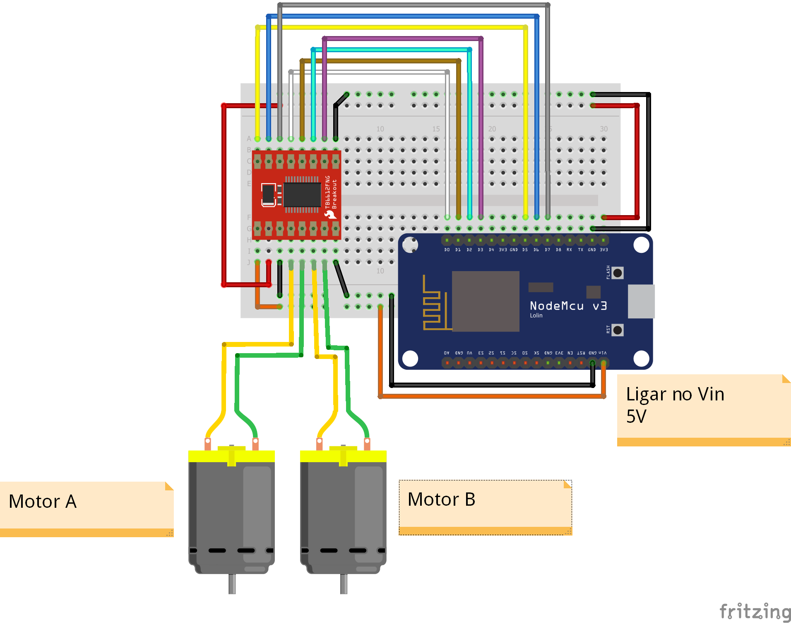

# Códigos fonte ESP8266 - Arduino IDE

Acelerômetro utizando ESP8266

* Na utilização do driver para controle dos motores DC devera ser seguido o esquema de ligação apresentado.
* Detalhes do driver **TB6612FNG** e Esquema de ligação do driver **TB6612FNG**

  
  

